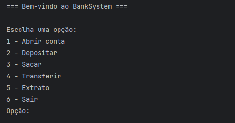
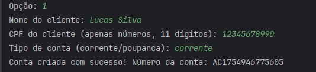
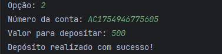
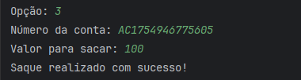
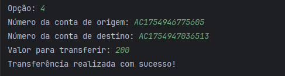
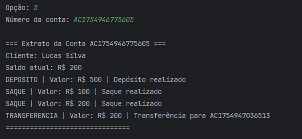

# BankSystem


Sistema bancário básico desenvolvido em Java que simula operações como abertura de conta, depósitos, saques, transferências e acompanhamento do histórico de transações.

---

## Índice

- [Descrição do Projeto](#descrição-do-projeto)
- [Funcionalidades](#funcionalidades)
- [Tecnologias Utilizadas](#tecnologias-utilizadas)
- [Requisitos](#requisitos)
- [Como Rodar](#como-rodar)
- [Exemplos de Uso](#exemplos-de-uso)
- [Estrutura do Projeto](#estrutura-do-projeto)
- [Testes Unitários](#testes-unitários)


---

## Descrição do Projeto

O BankSystem é um sistema bancário simples que demonstra o uso de conceitos de programação orientada a objetos (POO) como encapsulamento, herança, polimorfismo e abstração.

Permite criar contas correntes e poupança, realizar depósitos, saques, transferências e consultar o extrato de transações.

Além disso, o sistema utiliza um repositório em memória para simular persistência, Lombok para reduzir código, e possui testes unitários para garantir qualidade.

---

## Funcionalidades

- Abrir contas correntes e poupança
- Depositar valores em contas
- Sacar valores com validação de saldo
- Transferir valores entre contas
- Visualizar extrato com histórico detalhado de transações
- Validação básica do CPF e tipo de conta na criação

---

## Tecnologias Utilizadas

- Java 21
- Maven
- JUnit 5 para testes unitários
- Lombok para geração automática de getters/setters e construtores
- Uso de enums para tipos de transações


---

## Requisitos

- JDK 21 
- Maven instalado
- IDE recomendada: IntelliJ IDEA (mas qualquer IDE Java serve)

---

## Como Rodar

1. Clone o repositório:
```bash
git clone https://github.com/leolsm12/BankSystem.git
```

2. Navegue até o diretório do projeto:
```bash 
cd BankSystem
```
3. Compile o projeto usando Maven:
```bash 
mvn clean compile exec:java -Dexec.mainClass="com.banksystem.App"
```
4. Use o menu interativo no console para operar o sistema. 

## Exemplos de Uso

Use o menu interativo no console para operar o sistema.



### Abrir uma Conta
1. Escolha a opção **1** no menu.
2. Informe o **nome do cliente**.
3. Informe **CPF válido** (somente números, 11 dígitos).
4. Informe o **tipo da conta** (`corrente` ou `poupanca`).
5. Será exibido o **número da conta criada**.




### Depositar
1. Escolha a opção **2** no menu.
2. Informe o **número da conta**.
3. Informe o **valor a depositar**.



### Sacar
1. Escolha a opção **3** no menu.
2. Informe o **número da conta**.
3. Informe o **valor a sacar**.



### Transferir
1. Escolha a opção **4** no menu.
2. Informe o **número da conta de origem**.
3. Informe o **número da conta de destino**.
4. Informe o **valor para transferir**.



### Extrato
1. Escolha a opção **5** no menu.
2. Informe o **número da conta** para visualizar o extrato detalhado.



## Estrutura do Projeto

A estrutura do projeto é organizada da seguinte forma:

```
src/
├── main/
│   ├── java/com/bankSystem/
│   │   ├── model/                 # Classes de domínio (Conta, Cliente, Transação)
│   │   ├── repository/            # Repositórios em memória
│   │   ├── service/               # Regras de negócio
│   │   └── App.java               # Classe principal
├── test/
│   └── java/com/bankSystem/model/
│       ├── ContaTest.java
│       ├── HistoricoTransacoesTest.java
│       └── TransacaoTest.java
``` 


### Pré-requisitos para rodar os testes

- **Java 21** instalado e configurado no PATH.
- **Apache Maven** instalado ([Guia de instalação](https://maven.apache.org/install.html)).

Para verificar se está tudo instalado corretamente:

```bash
java -version
mvn -version
```

##  Testes Unitários

O projeto possui testes unitários para as principais operações, garantindo:

- **Depósito** correto em contas.
- **Saques** válidos e bloqueio quando saldo insuficiente.
- **Transferência** entre contas.
- **Histórico de transações** atualizado corretamente.

### Executando os testes

Na pasta raiz do projeto, execute:

```bash
mvn test
